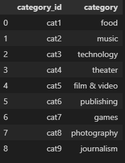
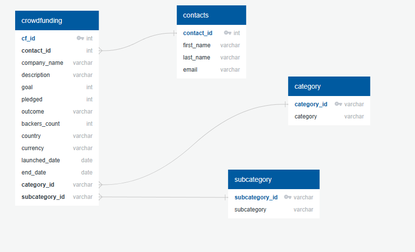

# Data-Extract-Transform-Load-Project

# Introduction 

This Project involved us focusing on two different sets of data comprising off Crowdfunding Data and Contacts Information. These files were in the form of CSV Files. The goal of the project was to use Extract, Load and Transform processes to consolidate information and restructure to desired data relationships in the form of new DataFrames/Tables.

# ***Files***
## *README*  
File summarising the information regarding the project.
## *ETL_Project_JUPN* : 
Completed Jupiter Notebook file containing the solutions in which the outputs, schema and ERD information was obtained from.
## *Resources*
Folder containing the CSV files used in this Anlaysis.
## *Output*
Contains DataFrame's of results from the notebook exported as CSV files.

# ***Analysis***

## Extract 
This involved extracting the two CSV files and examining both files to see what data types and information we were working with.

 

## Transform
Many of the columns contained specific pieces of information we required to be in seperate DataFrames to which we need to tranform and concatinate into specific Dataframes:
image.png
Category and Subcategory DF's were required from the initial crowdfunding csv.

Data for the Campaign DF also required to be transformed into different forms and the concatinated into a final DataFrame which was consequently exported to a CSV file illustrated below.

The contacts CSV was extracted and then transformed in dictionary using JSON methods to extract information from each row to reorganise the data as shown.

To better present the created data the columns were split and then created into a clearer output DF from the Dictionairy List created earlier.

## Load

The Load aspect of this project involved using the DataFrames CSV's created to be loaded into PostgreSQL, a relational database was chosen over non-relational as the team felt it would be better to visualise, create and analyse the realtionship between the datasets as it was a small dataset in which PostgreSQL could easily run the queries.

This resulted in the following ERD being Produced based on the relations to from the Table Queries generated.

# ***Comments***

* The ETL mini project, demonstrated a clear ETL pipline using Python, Pandas, Python Dict Methods and Regex Methods utilised efficiently to extract and transform the data to which ouput CSV's we're utilised to create a Table Schema and ERD.

* The interesting aspects of this project was the restructure of data in which it could be extracted and tranformed to be better utilised for other purposes, it was made evident in later stages how relations between the tables and data became apparant. 

The Authors of this Project:

Mohammed Rizwan Nawaz.
Mariama Doumbouya Diallo.
Dalitso Sandiyang'ane.
James Hand.